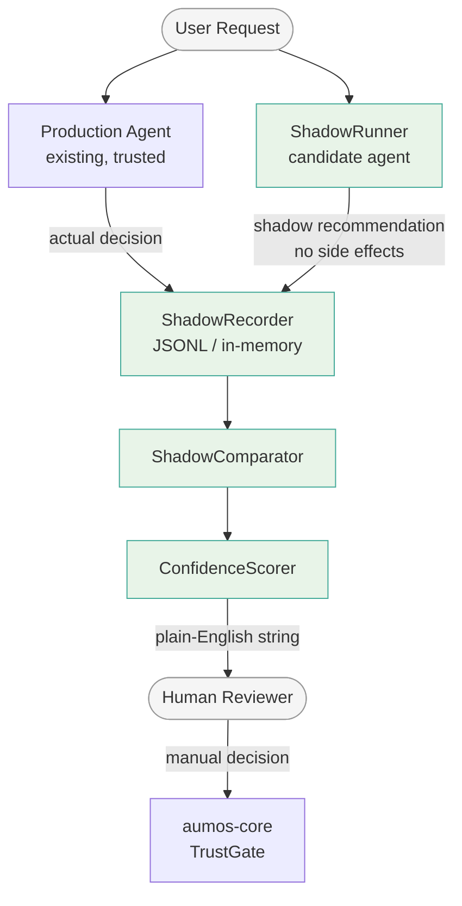

# agent-shadow-mode

Run an AI agent in shadow mode — observe real decisions, generate parallel recommendations, compare outcomes. Build a trust track record before going live.

[](https://pypi.org/project/agent-shadow-mode/)
[](https://www.npmjs.com/package/@aumos/shadow-mode)
[](LICENSE)
[](https://github.com/aumos-ai/agent-shadow-mode)

---

## Why Does This Exist?

Every new AI agent starts with an uncomfortable question: how do you know it is safe to trust it with real consequences before you have any evidence that it behaves correctly? The obvious answer — "put it in production and watch" — is unacceptable when wrong decisions mean money lost, customers harmed, or regulations violated.

Traditional software testing solves part of this problem. Unit tests verify logic; integration tests verify wiring. But AI agents are probabilistic. Their outputs shift with input distribution, model updates, and edge cases no test suite could enumerate. You cannot test an agent into trustworthiness — you have to observe it.

Shadow mode is the missing step between staging and production. You run your new agent against every real request your production system receives, capture what it *would have done*, compare that to what production *actually did*, and accumulate a scored track record over days or weeks. No one gets hurt. No side effects fire. When the track record is strong enough, a human decides to promote the agent. The tool never makes that decision for you.

**The driving-simulator analogy:** A learner driver does not start on a motorway. They first train in a simulator that mirrors real road conditions — the same traffic, the same decisions — but without real consequences. Shadow mode is that simulator for AI agents. Practice with real traffic, no real stakes.

**Without this tool:** Teams either over-trust new agents (deploy fast, discover failures in production) or under-trust them (keep humans in the loop forever, never gaining the efficiency benefit of automation). Shadow mode gives you the evidence to make the promotion decision rationally instead of politically.

---

## Who Is This For?

| Audience | Use Case |
|---|---|
| **Developer** | Evaluate a new agent version before replacing the production agent |
| **Enterprise** | Build an auditable evidence trail for governance and compliance review before any automated action is approved |
| **Both** | A/B test policy changes or model upgrades without exposing users to unverified behaviour |

---

## What Is Shadow Mode?

Shadow mode lets you run a new AI agent or decision system in parallel with an existing (production) system, without exposing its outputs to end users or triggering side effects. You capture what the shadow agent *would have done*, compare it to what the production agent *actually did*, and accumulate a scored track record.

Only a human operator reviews the track record and decides whether to promote the agent. The tool never changes trust levels automatically.

```
User Request
     │
     ├──► Production Agent ──► Actual Decision (recorded)
     │
     └──► Shadow Agent ──► Shadow Recommendation (no side effects)

ShadowComparator ──► ComparisonResult
ConfidenceScorer ──► ConfidenceReport ──► Human-readable recommendation string
```

---

## Installation

**Python**

```bash
pip install agent-shadow-mode
```

**TypeScript / Node.js**

```bash
npm install @aumos/shadow-mode
```

---

## Quick Start (Python)

**Prerequisites:** Python >= 3.10

```bash
pip install agent-shadow-mode
```

```python
import asyncio
from shadow_mode import ShadowRunner, ShadowComparator, ConfidenceScorer
from shadow_mode.adapters import GenericAdapter
from shadow_mode.types import ActualDecision

async def candidate_agent(input_data: dict[str, object]) -> dict[str, object]:
    return {"action": "approve", "reason": "within_policy"}

async def main() -> None:
    runner = ShadowRunner(agent_fn=candidate_agent, adapter=GenericAdapter())
    shadow_decision = await runner.shadow_execute({"amount": 500, "user": "alice"})

    actual = ActualDecision(
        decision_id=shadow_decision.decision_id,
        output={"action": "approve", "reason": "within_policy"},
        timestamp=shadow_decision.timestamp,
    )
    comparison = ShadowComparator().compare(shadow_decision, actual)
    report = ConfidenceScorer().score([comparison])
    print(report.recommendation)  # "Based on 1 decision, continue collecting data."

asyncio.run(main())
```

**What just happened?**
1. `ShadowRunner` executed `candidate_agent` inside a side-effect-free context — no HTTP calls, no DB writes, no queue messages left the process.
2. `ShadowComparator` compared the shadow output to what production actually returned.
3. `ConfidenceScorer` aggregated the result into a plain-English recommendation string. After enough comparisons, that string tells a human reviewer whether the track record justifies promotion.

---

## Quick Start (TypeScript)

**Prerequisites:** Node.js >= 20

```bash
npm install @aumos/shadow-mode
```

```typescript
import { ShadowRunner, ShadowComparator, ConfidenceScorer, type ActualDecision } from "@aumos/shadow-mode";

const runner = new ShadowRunner(async (input: Record<string, unknown>) => {
  return { action: "approve", reason: "within_policy" };
});

const shadowDecision = await runner.shadowExecute({ amount: 500, user: "alice" });

const actual: ActualDecision = {
  decisionId: shadowDecision.decisionId,
  output: { action: "approve", reason: "within_policy" },
  timestamp: new Date().toISOString(),
};

const comparison = new ShadowComparator().compare(shadowDecision, actual);
const report = new ConfidenceScorer().score([comparison]);
console.log(report.recommendation);
// "Based on 1 decision, continue collecting data."
```

**What just happened?**
The candidate agent ran without touching any real external systems. The comparator checked agreement between its output and what production returned. The scorer produced a plain-English string — no automated trust changes, no side effects, just evidence for a human reviewer.

---

## Architecture

See [docs/architecture.md](docs/architecture.md) for the full design.

### AumOS Ecosystem Placement



### Core Components

| Component | Role |
|---|---|
| `ShadowRunner` | Executes agent without side effects via adapter context manager |
| `ShadowComparator` | Compares shadow recommendation to actual production decision |
| `ConfidenceScorer` | Aggregates comparison results into a human-readable confidence report |
| `ShadowRecorder` | In-memory and persistent history of shadow decisions |
| Adapters | Framework-specific side-effect interception (Generic, LangChain, CrewAI) |

### Adapters

| Adapter | Use Case |
|---|---|
| `GenericAdapter` | Wraps any Python callable |
| `LangChainAdapter` | Intercepts LangChain tool calls |
| `CrewAIAdapter` | Intercepts CrewAI task execution |

---

## Related Projects

| Project | Relationship |
|---|---|
| [aumos-core](https://github.com/aumos-ai/aumos-core) | Trust Ladder and Trust Gate — the system shadow mode feeds evidence into (via human decision) |
| [governance-linter](https://github.com/aumos-ai/governance-linter) | Catches governance gaps at development time; shadow mode catches behavioural gaps at runtime |
| [mcp-server-trust-gate](https://github.com/aumos-ai/mcp-server-trust-gate) | MCP server for runtime policy enforcement — a natural promotion target after shadow mode approval |
| [agent-benchmark-governance](https://github.com/aumos-ai/agent-benchmark-governance) | Batch evaluation benchmarks; shadow mode is the continuous, production-traffic complement |

---

## Fire Line

This project has strict boundaries. See [FIRE_LINE.md](FIRE_LINE.md).

**Shadow mode never automatically changes trust levels.** The `ConfidenceReport.recommendation` field is a plain string like `"Based on 95% agreement over 200 decisions, consider promoting to L3."` — it is advisory only. No API calls are made.

---

## Examples

- [`examples/basic_shadow.py`](examples/basic_shadow.py) — Shadow a simple function
- [`examples/langchain_shadow.py`](examples/langchain_shadow.py) — Shadow a LangChain agent
- [`examples/evaluation_report.py`](examples/evaluation_report.py) — Generate a full trust-building report

---

## License

Business Source License 1.1. See [LICENSE](LICENSE) and https://mariadb.com/bsl11/.

Copyright (c) 2026 MuVeraAI Corporation.
